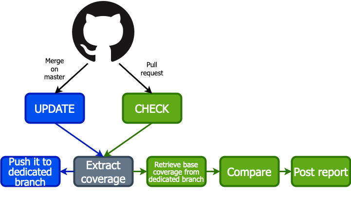
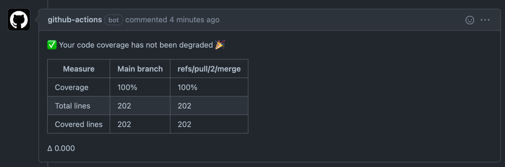
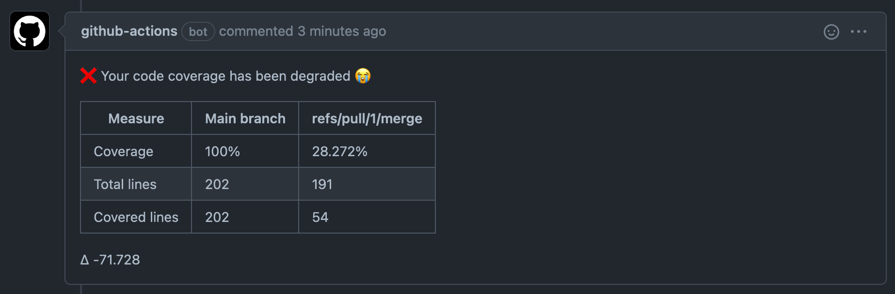

# coverage-checker

A Github action to check if you didn't degrade your code coverage.

## Description

This action is split into two actions :

| Context | Action | Description |
|---------|--------|-------------|
| Push on main branch | update | By configuring the "update" action to be ran on pushes to your main branch, it will parse your clover file, generate a JSON containing interesting metrics, and push it to a branch named _coverage_. You'll benefit from the natural commits history to track the evolution of your overall coverage.
| Pull request | check | By configuring the "check" action to be ran on pull requests, it will get the main branch's coverage, located in the _coverage_ branch, and compare it to your pull request's coverage. A report will be posted as a comment on your pull request, and the action will fail if the coverage has been degraded.




## The actions

### Update

The update process is the one used to update coverage report for the main branch of the project. After calculation, it pushes results to a dedicated `coverage` branch.

**Here is an exemple of how to use it (on a php project) :**

```yaml
name: Coverage update
on:
  push:
    branches:
      - main
jobs:
  coverage_update:
    runs-on: ubuntu-lastest
    steps:
      - uses: actions/checkout@v2
      - name: Install dependencies
        run: composer install --prefer-dist --no-progress --no-suggest
      - name: Run test suite
        run: make test
      - name: Coverage update
        uses: OpenClassrooms/coverage-checker@v1.0.0
        with:
          token: ${{ secrets.GITHUB_TOKEN }}
          action: update
```
> Note that the `Run test suite` step will generate a [`clover` file containing the coverage information](https://openclover.org/documentation). This action will use this file to generate the report.

### Check

```yaml
name: Coverage check
on: [pull_request]
jobs:
  coverage_check:
    runs-on: ubuntu-lastest
    steps:
      - uses: actions/checkout@v2
      - name: Install dependencies
        run: composer install --prefer-dist --no-progress --no-suggest
      - name: Run test suite
        run: make test
      - name: Coverage check
        uses: OpenClassrooms/coverage-checker@v1.0.0
        with:
          token: ${{ secrets.GITHUB_TOKEN }}
          action: check
```

The output of this action is a comment on the PR to simply see if the coverage has been degraded or not, and an action failure in case of degradation.





## Configuration reference

| Parameter | Required | Default    | Comment |
|-----------|----------|------------|---------|
| `token`   | Yes      | No default | The action token. Will be used to push or read from _coverage_ branch |
| `action`  | No       | `update`   | The action to be executed. Either `update` or `check` |
| `coverage-files` | No | `[{"coverage": "coverage.xml", "summary": "coverage-summary.json"}]` | An array of objects representing the **clover** file that will be generated by your test suite and the **json** file that will be created by this action and uploaded to the `coverage` branch |

## Contributing

### Setup your dev env

After having cloned the project, run `make install`, that will install dependencies, and [ncc](https://www.npmjs.com/package/@vercel/ncc) (required to compile code before pushing it).

### Compile & commit

Compile code before committing by running this command:
`make`
